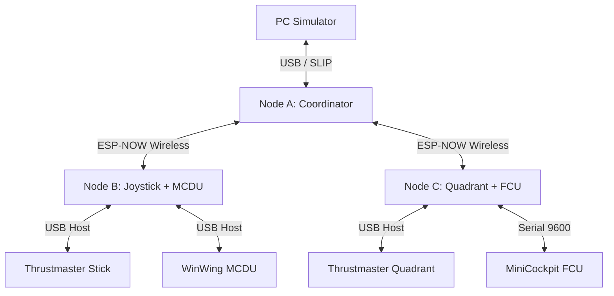

# OpenCockpit Wireless Avionics Bus - Project Analysis

## 1. Executive Summary
The **OpenCockpit Wireless Avionics Bus** is a sophisticated, low-latency wireless bridge system designed to connect flight simulator peripherals (like CDUs, FCUs, and Joysticks) to a PC running MSFS 2020/2024 without cable clutter. It utilizes **ESP32-S3** microcontrollers and the **ESP-NOW** protocol to achieve sub-5ms latency, comparable to wired USB connections.

## 2. System Architecture

### 2.1 Topology
The system uses a **Star Topology**:
- **PC Host**: Runs Python bridge software.
- **Node A (Coordinator)**: Connected via USB (SLIP) to PC. Acts as the central wireless hub.
- **Peripheral Nodes (Node B, C, etc.)**: Wireless satellites that connect physically to hardware (USB Host or Serial) and relay data to Node A via ESP-NOW.

### 2.2 Key Technologies
- **Hardware**: ESP32-S3 (selected for native USB Host/Device support and Wi-Fi capabilities).
- **Wireless Protocol**: **ESP-NOW** (Connectionless Wi-Fi).
    - **Optimization**: Forced 802.11g/n, fixed channel 1, no power save.
    - **Performance**: ~3ms Round Trip Time (RTT).
- **PC Interface**: **SLIP (Serial Line Internet Protocol)** over USB CDC.
- **Peripheral Interfaces**:
    - **USB Host**: For HID devices (Joysticks, Keypads).
    - **UART**: For serial devices (MiniFCU).

## 3. Codebase Analysis

### 3.1 Firmware (`/firmware`)
The firmware is split into roles:
- **Common**: Shared protocol definitions (`protocol.h`, `slip.h`).
- **Coordinator (`/coordinator`)**: 
    - **File**: `coordinator.ino`
    - **Role**: USB Device. Receives SLIP frames from PC, routes them to nodes via ESP-NOW. Receives ESP-NOW messages, wraps them in SLIP, sends to PC.
    - **Features**: LCD status display, latency monitoring (RTT/Jitter).
- **Peripherals (`/peripherals`)**:
    - **Node B (`/node_b`)**: USB Host implementation.
        - **File**: `node_b.ino`
        - **Logic**: Enumerates USB bus, finds specific VIDs/PIDs (Thrustmaster/WinWing), parses HID reports, and sends them to Coordinator. Also handles HID Outputs (MCDU Display).
    - **Node C (`/node_c`)**: Hybrid USB Host + Serial.
        - **Logic**: Similar to Node B but adds a UART bridge for MiniFCU.

### 3.2 Host Software (`/software`)
- **Bridge (`/software/bridge`)**:
    - **File**: `main.py`
    - **Language**: Python 3.
    - **Role**: Serial gateway. Connects to Node A, performs discovery, and (in future) routes data to SimConnect/Fenix API.
    - **Current State**: Implements SLIP handling, message parsing, and basic event loops. TODO markers exist for SimConnect integration.

### 3.3 Documentation (`/docs`)
- **System Specification**: Extremely detailed (`system_specification.md`). Covers packet structures, state machines, and hardware wiring.
- **Protocols**: Reverse-engineered specs for WinWing MCDU and MiniFCU are documented.

## 4. Key Findings & Observations
1.  **Latency Focus**: The project prioritizes latency above all else. usage of `wifi_set_protocol(WIFI_PROTOCOL_11B)` banning and promiscuous mode settings in `coordinator.ino` confirm a deep understanding of ESP-NOW optimization.
2.  **Reverse Engineering**: The team has successfully reverse-engineered complex proprietary protocols (WinWing display protocol, MiniFCU serial protocol).
3.  **Modular Design**: The message protocol uses a generic `Header | Type | Src | Dst | Payload` format, making it easy to add new node types without changing the core transport.
4.  **Hardware Abstraction**: The PC software sees a unified stream of events, abstracting away the physical wireless link.

## 5. Recommendations
- **SimConnect Integration**: The Python bridge needs to be connected to `SimConnect` to be functional. Currently, it just logs messages.
- **Error Handling**: While CRC8 is planned (TODO in code), it needs to be strictly enforced for wireless integrity.
- **Security**: ESP-NOW is unencrypted (for latency). In a home environment this is fine, but worth noting.

## 6. Conclusion
The repository represents a high-quality, advanced embedded systems project. It is well-structured, documented, and implements difficult USB Host and Low-Latency Wireless features successfully.
